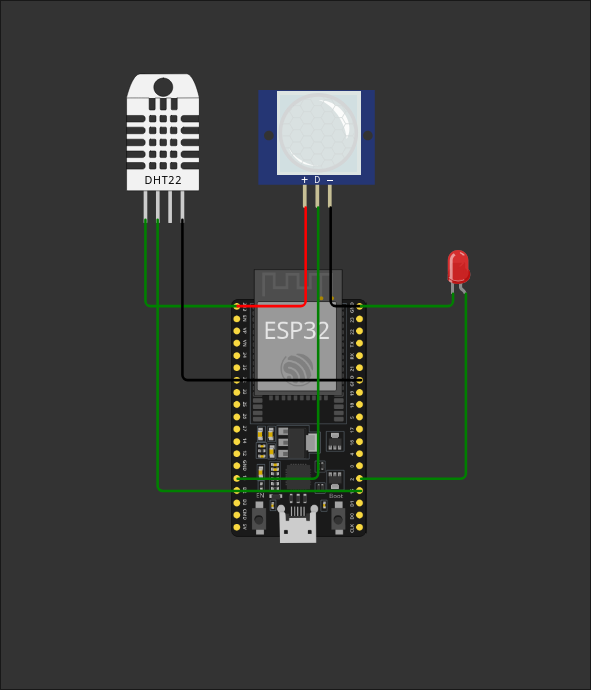
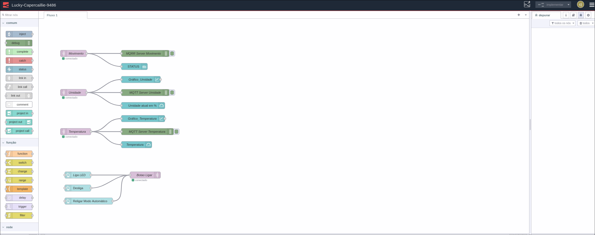
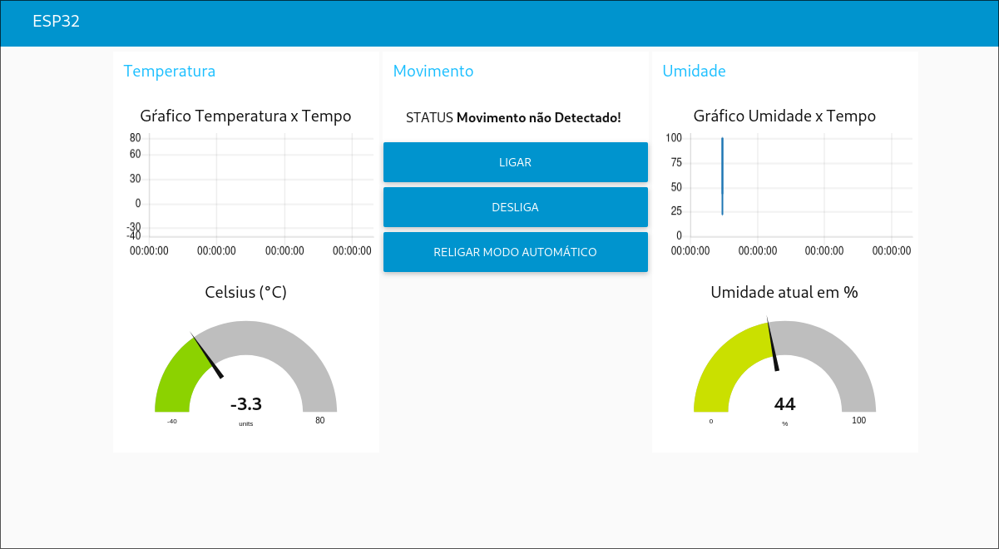

# Projeto IOT MQTT

## Contexto

Este projeto foi desenvolvido como parte da disciplina Internet das Coisas em um Mundo Conectado, do curso de Análise e Desenvolvimento de Sistemas da PUC-PR.

## Descrição do Projeto

O tema central do projeto é Cidades Inteligentes, com o objetivo de criar um conceito de poste inteligente. O sistema utiliza sensores para detectar movimento, permitindo a economia de energia ao apagar o poste quando não há presença de pessoas ou veículos. Para simular o funcionamento do projeto, foi utilizado um ESP32 na plataforma Wokwi.

As informações coletadas pelos sensores são enviadas através de um broker MQTT para a plataforma FlowFuse, onde foi desenvolvido um dashboard para monitoramento e visualização dos dados.

Além disso, o dashboard inclui três botões que permitem o controle manual do ESP32. Toda a comunicação entre os dispositivos e a interface é realizada via MQTT.

